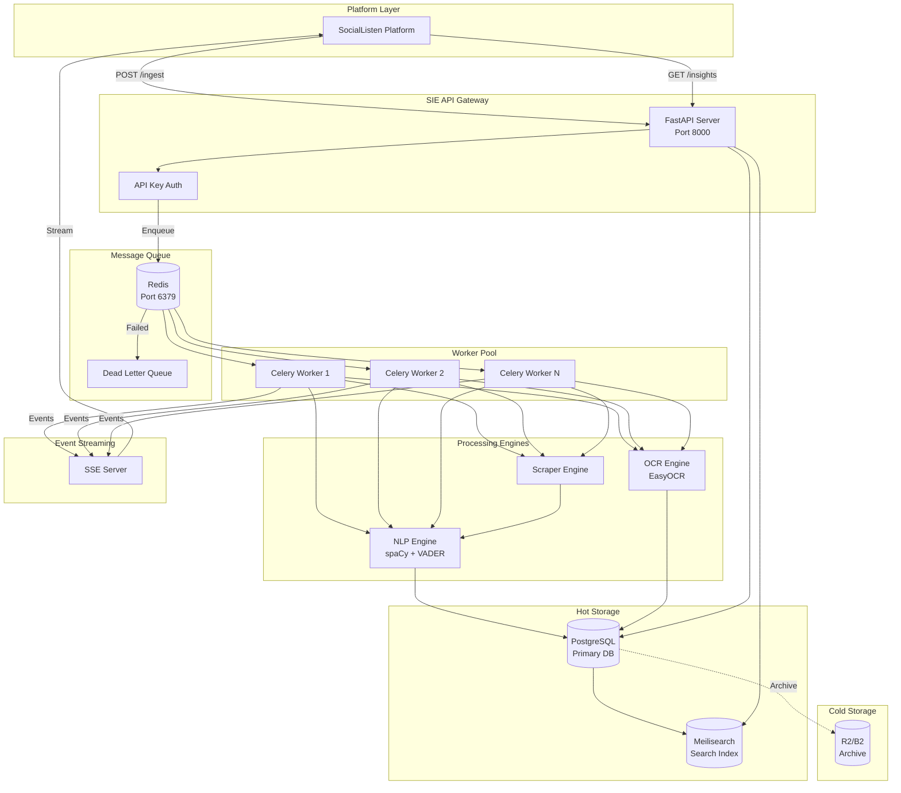
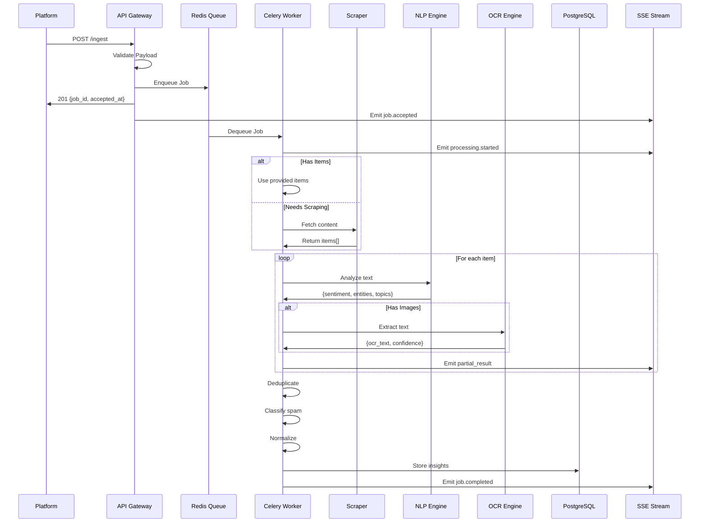
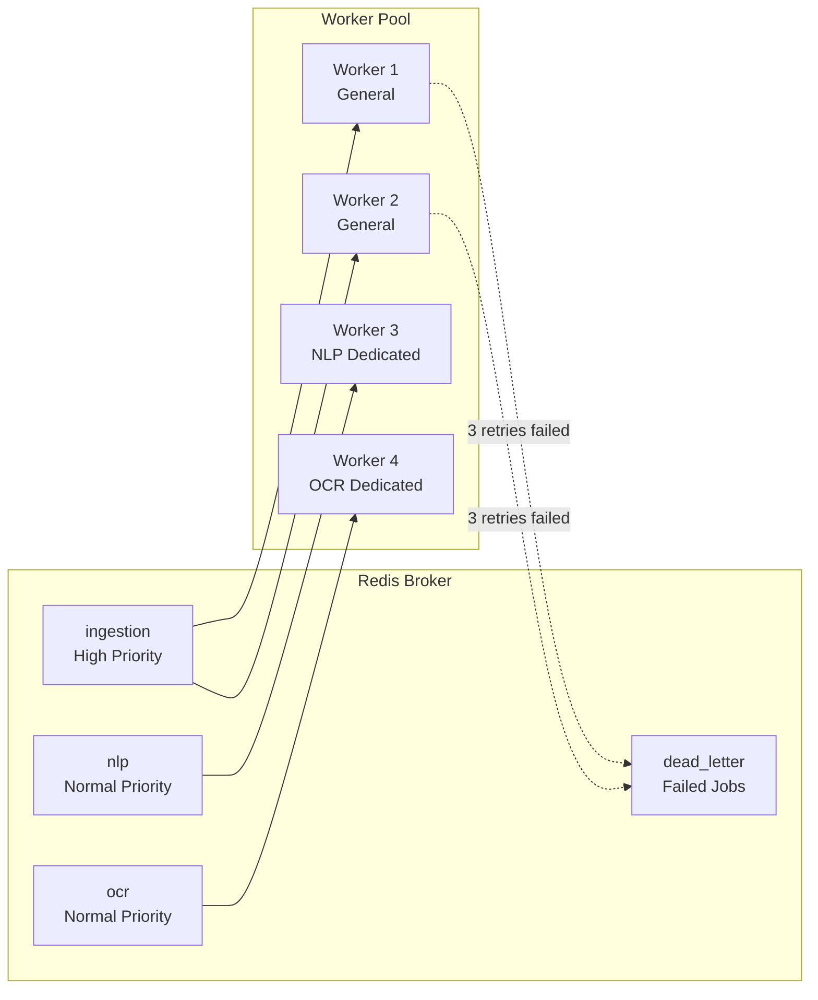
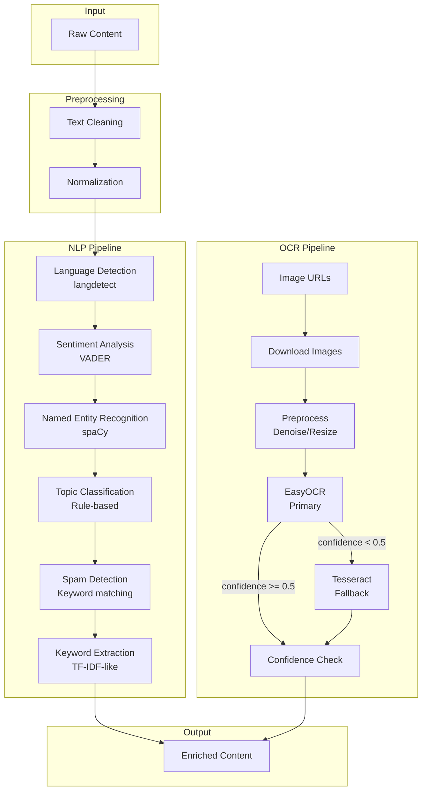
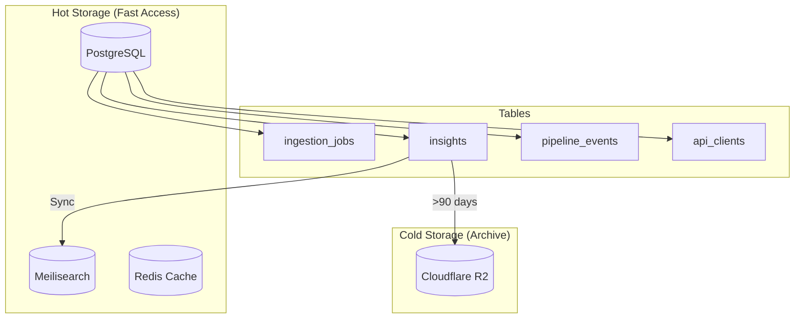
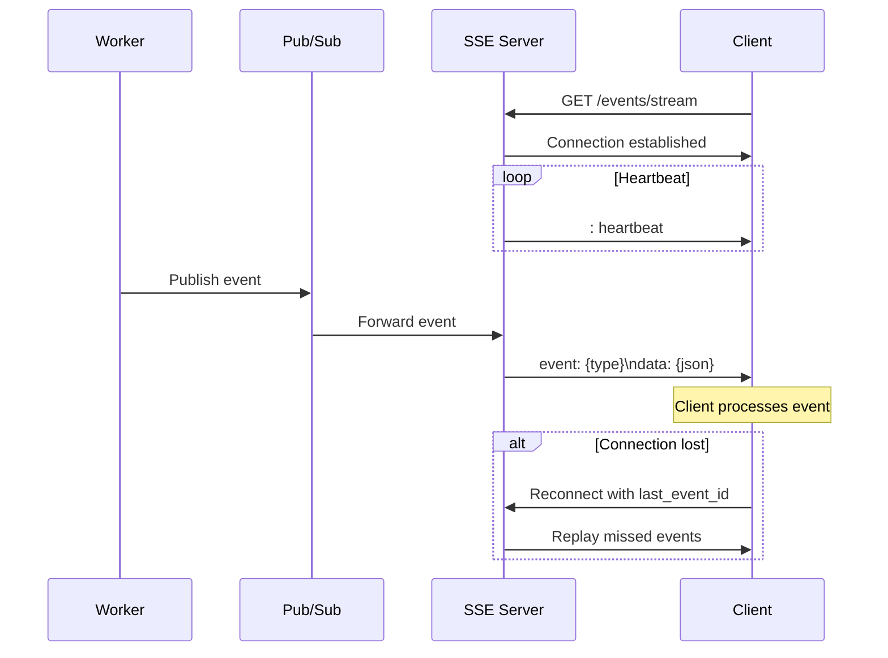
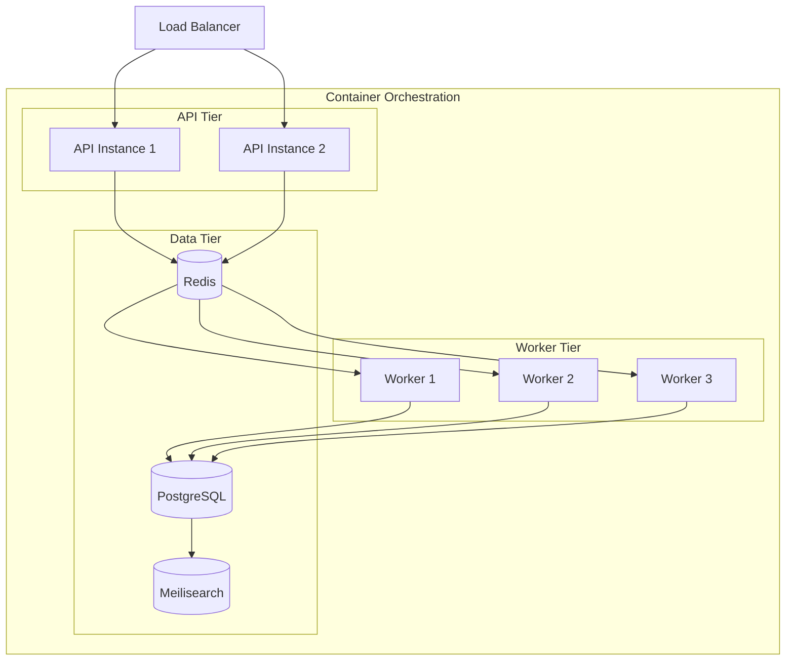
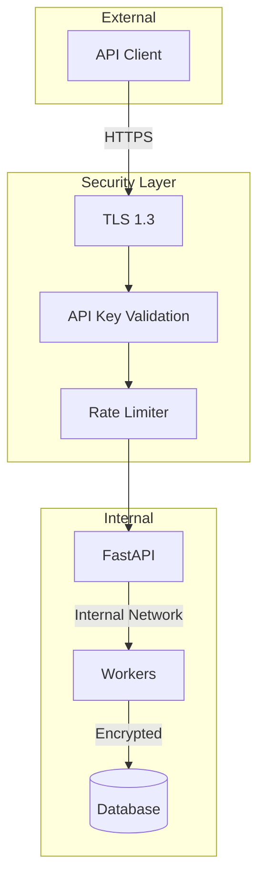

# SIE System Architecture Blueprint
## Smart Ingestion Engine v1.0

---

## 1. High-Level Architecture

---

## 2. Ingestion Flow

---

## 3. Queue & Workers Topology

### Queue Configuration

| Queue | Priority | Concurrency | Timeout | Retries |
|-------|----------|-------------|---------|---------|
| `ingestion` | High (10) | 4 workers | 10 min | 3 |
| `nlp` | Normal (5) | 2 workers | 5 min | 3 |
| `ocr` | Normal (5) | 2 workers | 5 min | 3 |
| `dead_letter` | Low (1) | 1 worker | - | 0 |

---

## 4. NLP/OCR Pipeline

### NLP Performance Targets

| Component | Accuracy | Latency (p95) | Throughput |
|-----------|----------|---------------|------------|
| Language | 95%+ | < 10ms | 1000/s |
| Sentiment | 85%+ | < 50ms | 500/s |
| NER | 80%+ | < 100ms | 200/s |
| Topics | 75%+ | < 20ms | 500/s |

### OCR Performance Targets

| Component | Accuracy | Latency (p95) | Notes |
|-----------|----------|---------------|-------|
| EasyOCR | 90%+ | < 2s | Primary engine |
| Tesseract | 80%+ | < 1s | Fallback only |

---

## 5. Storage Layout

### Retention Policy

| Storage | Data | Retention | Purpose |
|---------|------|-----------|---------|
| PostgreSQL | Jobs | 90 days | Active queries |
| PostgreSQL | Insights | 90 days | API access |
| PostgreSQL | Events | 7 days | Debugging |
| Meilisearch | Insights | 90 days | Full-text search |
| R2/B2 | Archive | 2 years | Compliance |

---

## 6. Event Streaming

### Event Types

| Event | Stage | Payload |
|-------|-------|---------|
| `job.accepted` | Ingestion | `{job_id, tenant, accepted_at}` |
| `processing.started` | Processing | `{job_id, stage}` |
| `partial_result` | Processing | `{job_id, items_processed}` |
| `nlp.completed` | Enrichment | `{job_id, items_count}` |
| `ocr.completed` | Enrichment | `{job_id, images_processed}` |
| `job.completed` | Complete | `{job_id, insights_count, time_ms}` |
| `job.failed` | Error | `{job_id, error, retry_count}` |

---

## 7. Deployment Architecture

### Resource Allocation (MVP)

| Service | CPU | Memory | Replicas |
|---------|-----|--------|----------|
| API | 0.5 | 512MB | 2 |
| Worker | 1.0 | 2GB | 3 |
| PostgreSQL | 1.0 | 1GB | 1 |
| Redis | 0.25 | 256MB | 1 |
| Meilisearch | 0.5 | 512MB | 1 |

---

## 8. Security Architecture

### Security Controls

| Layer | Control | Implementation |
|-------|---------|----------------|
| Transport | TLS 1.3 | Load balancer termination |
| Authentication | API Keys | X-API-Key header |
| Authorization | Tenant isolation | Row-level filtering |
| Rate Limiting | Per-client | Redis token bucket |
| Data | Field encryption | PII redaction |

---

## References

- [Microservices Architecture](https://martinfowler.com/articles/microservices.html)
- [Celery Best Practices](https://docs.celeryq.dev/en/stable/userguide/tasks.html)
- [spaCy Pipelines](https://spacy.io/usage/processing-pipelines)
- [Meilisearch Docs](https://www.meilisearch.com/docs)
